# stm32mp157

### 1 修改设备树

STM32MP157设备树修改及上机实验

查看原理图确定按键引脚

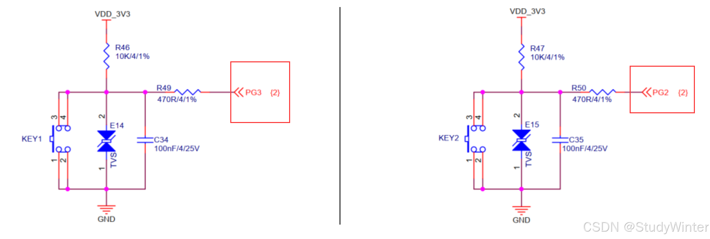

修改设备树 arch/arm/boot/dts/stm32mp157c-100ask-512d-lcd-v1.dts

```
gpio_keys_winter {
    compatible = "winter,gpio_key";
    gpios = <&gpiog 2 GPIO_ACTIVE_LOW
             &gpiog 3 GPIO_ACTIVE_LOW>;
};
```

> - `gpio_keys_winter { ... };`：这是一个设备节点的定义，名字是 `gpio_keys_winter`，表示这个节点描述的是一些GPIO按键。
>
> - `compatible` 属性用于指定该设备节点所兼容的设备驱动程序。这里的值 `"winter,gpio_key"` 表示这个设备与名为 `winter,gpio_key` 的驱动程序兼容，通常这个驱动程序会识别并处理这个设备节点所描述的硬件。
>
> - `gpios = <...>;`：`gpios` 属性定义了使用的GPIO引脚。它使用了一个以 `< >` 包裹的数组，数组中的每一项对应一个GPIO的描述。
>
> - `&gpiog 2 GPIO_ACTIVE_LOW`：`&gpiog` 是一个指向GPIO控制器的引用，`2` 表示使用GPIO控制器的第2号引脚，`GPIO_ACTIVE_LOW` 表示该引脚在低电平时为活动状态。
>
> - `&gpiog 3 GPIO_ACTIVE_LOW`：同样，`&gpiog` 引用了GPIO控制器，`3` 表示使用第3号引脚，`GPIO_ACTIVE_LOW` 表示该引脚在低电平时为活动状态。
>
>   
>
>   这段代码定义了一个名为 `gpio_keys_winter` 的设备节点，该节点描述了两个使用 `gpiog` 控制器的GPIO按键，它们分别是2号和3号引脚，并且它们在低电平时被认为是按键被按下（即“活动”状态）。这个节点与 `winter,gpio_key` 驱动程序兼容。

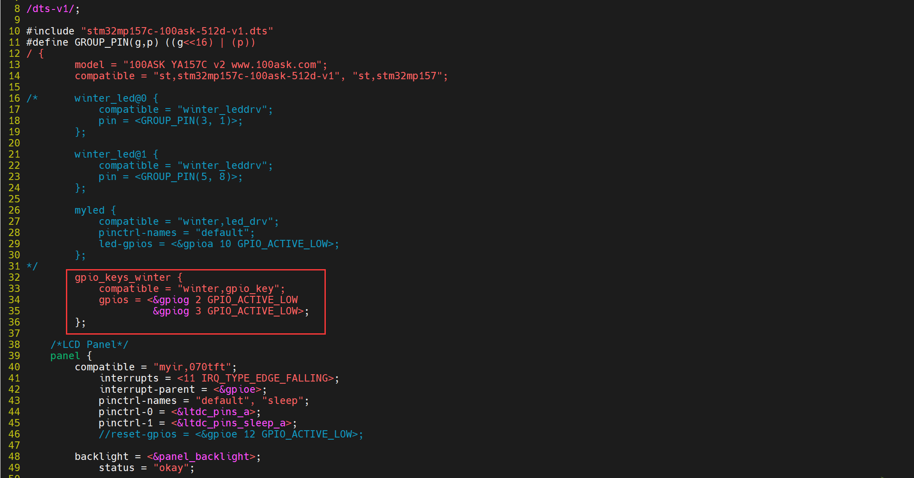

这个设备树在使用的时候会和已有的发生冲突，改掉已有的，先查找是哪个

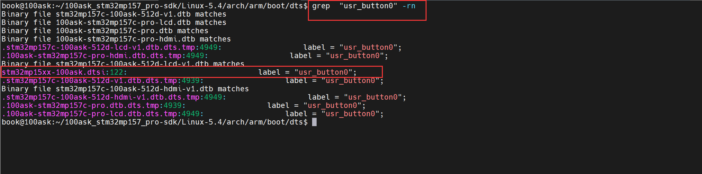

把原来的GPIO按键节点禁止掉 ： 修改arch/arm/boot/dts/stm32mp15xx-100ask.dtsi

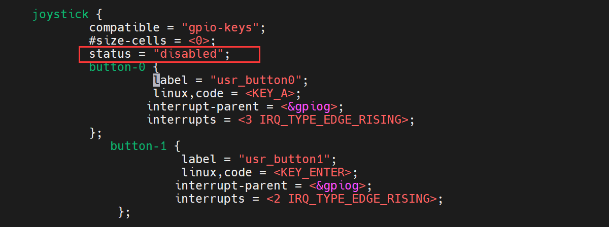

重新编译设备树

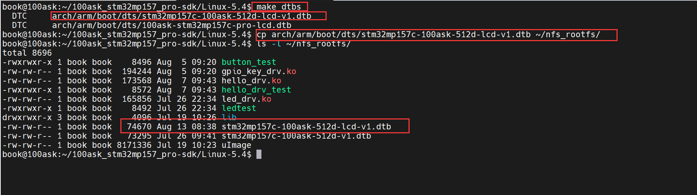

### 2 休眠唤醒

> ① APP 调用 read 等函数试图读取数据，比如读取按键；
> ② APP 进入内核态，也就是调用驱动中的对应函数，发现有数据则复制到用户空间并马上返回；
> ③ 如果 APP 在内核态，也就是在驱动程序中发现没有数据，则 APP 休眠；
> ④ 当有数据时，比如当按下按键时，驱动程序的中断服务程序被调用，它会记录数据、唤醒 APP；
> ⑤ APP 继续运行它的内核态代码，也就是驱动程序中的函数，复制数据到用户空间并马上返回。

环形缓冲区

#### 2.1 代码

##### gpio_key_drv.c

```cpp
#include <linux/module.h>

#include <linux/fs.h>
#include <linux/errno.h>
#include <linux/miscdevice.h>
#include <linux/kernel.h>
#include <linux/major.h>
#include <linux/mutex.h>
#include <linux/proc_fs.h>
#include <linux/seq_file.h>
#include <linux/stat.h>
#include <linux/init.h>
#include <linux/device.h>
#include <linux/tty.h>
#include <linux/kmod.h>
#include <linux/gfp.h>
#include <linux/gpio/consumer.h>
#include <linux/platform_device.h>
#include <linux/of_gpio.h>
#include <linux/of_irq.h>
#include <linux/interrupt.h>
#include <linux/irq.h>
#include <linux/slab.h>

// 2.1封装一个结构体
// 因为每个gpio都有这些属性，封装起来比较方便
struct gpio_key {
	int gpio;							// gpio编号
	int irq;							// 中断号
	enum of_gpio_flags flag;			// flag
	struct gpio_desc* gpiod;			// 描述
};

// 结构体指针
struct gpio_key* p_gpio_keys;
static int major = 0;
static struct class* gpio_key_class;

// 定义一个环形缓冲区存数据
#define BUF_LEN 128
static int g_keys[BUF_LEN];
static int r, w;

// 取下一个位置
#define NEXT_POS(x) ((x + 1) % BUF_LEN)

// 判断环形缓冲区是否为空
static int is_key_buf_empty(void)
{
	// 相等时为空
	return (r == w);
}

// 判断缓冲区是否满
static int is_key_buf_full(void)
{
	return (r == NEXT_POS(w));
}

// 写数据进去
static void put_key(int key)
{
	if (!is_key_buf_full())
	{
		g_keys[w] = key;
		// w后移
		w = NEXT_POS(w);
	}
}

// 获得数据
static int get_key(void)
{
	int key = 0;
	if (!is_key_buf_empty())
	{
		key = g_keys[r];
		// r后移
		r = NEXT_POS(r);
	}
	return key;
}


// 初始化等待队列
static DECLARE_WAIT_QUEUE_HEAD(gpio_key_wait);

// 2.3.1实现自己的read函数，等待按键按下
static ssize_t gpio_key_drv_read (struct file *file, char __user *buf, size_t size, loff_t *offset)
{
	int key;
	int err;
	printk("%s %s line %d\n", __FILE__, __FUNCTION__, __LINE__);
	// 数据从buf中读取
	// 当is_key_buf_empty为假时，也就是不空，休眠才被打断，才能get数据
	wait_event_interruptible(gpio_key_wait, !is_key_buf_empty());
	key = get_key();
	// 将数据拷贝给用户，即用户读数据
	err = copy_to_user(buf, &key, 4);
	return 4;
}

// 2.3 file_operations结构体
static struct file_operations gpio_key_drv = {
	.owner = THIS_MODULE,
	.read = gpio_key_drv_read,
};


// 2.2中断处理函数，唤醒线程
static irqreturn_t gpio_key_irq_winter(int irq, void *dev_id)
{
	struct gpio_key* gpio_key = dev_id;
	int val;
	int key;
	printk("%s %s line %d\n", __FILE__, __FUNCTION__, __LINE__);
	// 获取值
	val = gpiod_get_value(gpio_key->gpiod);
	// 输出key和对应的值
	printk("key %d %d\n", gpio_key->gpio, val);
	// 哪一个按键放在高8位，按下/松开是val
	key = (gpio_key->gpio << 8) | val;
	// 加入数据
	put_key(key);
	// 唤醒队列
	wake_up_interruptible(&gpio_key_wait);
	return IRQ_HANDLED;
}


// 2probe函数
/* a 从platform_device获得GPIO
 * b gpio=>irq，gpio资源转换成中断号
 * c request_irq
 */
int gpio_keys_probe(struct platform_device* pdev)
{
	int count, i;
	int err;
	unsigned flags = GPIOF_IN;
	enum of_gpio_flags flag;
	// platform_device转换成device_node
	struct device_node *node = pdev->dev.of_node;
	printk("%s %s line %d\n", __FILE__, __FUNCTION__, __LINE__);
	// a获得gpio
	count = of_gpio_count(node);
	if (count == 0)
	{
		printk("%s %s line %d, there isn't any gpio available\n", __FILE__, __FUNCTION__, __LINE__);
		return -1;
	}
	// 分配空间,内存情况k:kernel，z:zero
	p_gpio_keys = kzalloc(count * sizeof(struct gpio_key), GFP_KERNEL);

	// 针对每一个gpio操作
	for (i = 0; i < count; i++)
	{
		// b把设备结点中gpio的每个引脚都取出来，再转换成中断号
		p_gpio_keys[i].gpio = of_get_gpio_flags(node, i, &flag);
		if (p_gpio_keys[i].gpio < 0)
		{
			printk("%s %s line %d, of_get_gpio_flags fail\n", __FILE__, __FUNCTION__, __LINE__);
			return -1;
		}
		p_gpio_keys[i].gpiod = gpio_to_desc(p_gpio_keys[i].gpio);
		// 设备树中的flag:GPIO_ACTIVE_LOW & OF_GPIO_ACTIVE_LOW
		p_gpio_keys[i].flag = flag & OF_GPIO_ACTIVE_LOW;
		
		if (flag & OF_GPIO_ACTIVE_LOW)
		{
			flags |= GPIOF_ACTIVE_LOW;
		}
		// 申请并将gpio初始化为高电平
		err = devm_gpio_request_one(&pdev->dev, p_gpio_keys[i].gpio, flags, NULL);
		// 转换成中断号
		p_gpio_keys[i].irq = gpio_to_irq(p_gpio_keys[i].gpio);
	}

	// 当发生中断时，request_irq
	for (i = 0; i < count; i++)
	{
		// 双边沿触发，当发生irq中断时，内核会调用gpio_key_irq_winter中断处理函数，同时会把&p_gpio_keys[i])参数传进去
		err = request_irq(p_gpio_keys[i].irq, gpio_key_irq_winter, IRQF_TRIGGER_FALLING | IRQF_TRIGGER_RISING, "winter_gpio_key", &p_gpio_keys[i]);
	}

	// 注册file_operations结构体
	major = register_chrdev(0, "winter_gpio_key", &gpio_key_drv);
	// 注册结点
	gpio_key_class = class_create(THIS_MODULE, "winter_gpio_key_class");
	if (IS_ERR(gpio_key_class)) {
		printk("%s %s line %d\n", __FILE__, __FUNCTION__, __LINE__);
		unregister_chrdev(major, "winter_gpio_key");
		return PTR_ERR(gpio_key_class);
	}

	device_create(gpio_key_class, NULL, MKDEV(major, 0), NULL, "winter_gpio_key"); /* /dev/100ask_gpio_key */
	return 0;
}


// 3remove函数
int gpio_keys_remove(struct platform_device* pdev)
{
	struct device_node* node= pdev->dev.of_node;
	int count, i;
	printk("%s %s line %d\n", __FILE__, __FUNCTION__, __LINE__);

	device_destroy(gpio_key_class, MKDEV(major, 0));
	class_destroy(gpio_key_class);
	unregister_chrdev(major, "winter_gpio_key");

	// 释放每个gpio的空间
	count = of_gpio_count(node);
	for (i = 0; i < count; i++)
	{
		free_irq(p_gpio_keys[i].irq, &p_gpio_keys[i]);	
	}
	// 释放空间
	kfree(p_gpio_keys);
	return 0;
}


// 4资源
static const struct of_device_id winter_gpio_keys[] = {
	// 这里的数据和设备树的数据匹配
	{ .compatible = "winter,gpio_key" },
	{  },
};


// 1定义一个自己的platform_driver结构体
static struct platform_driver gpio_key_driver = {
	.driver = {
		.name		= "winter_gpio_keys",
		.of_match_table	= winter_gpio_keys,
	},
	.probe			= gpio_keys_probe,
	.remove			= gpio_keys_remove,
};


// 5入口函数和出口函数
static int __init gpio_keys_init(void)
{
	int err;
	printk("%s %s line %d\n", __FILE__, __FUNCTION__, __LINE__);
	// 注册platform结构体
	err = platform_driver_register(&gpio_key_driver);
	return 0;
}

// 出口函数
static void __exit gpio_keys_exit(void)
{
	printk("%s %s line %d\n", __FILE__, __FUNCTION__, __LINE__);
	// 注销platform_driver结构体
	platform_driver_unregister(&gpio_key_driver);
}

module_init(gpio_keys_init);
module_exit(gpio_keys_exit);
MODULE_LICENSE("GPL");

```

##### button_test.c

```cpp
#include <sys/types.h>
#include <sys/stat.h>
#include <fcntl.h>
#include <unistd.h>
#include <stdio.h>
#include <string.h>

/*
 * ./button_test /dev/100ask_button0
 *
 */
int main(int argc, char **argv)
{
	int fd;
	int val;
	
	/* 1. 判断参数 */
	if (argc != 2) 
	{
		printf("Usage: %s <dev>\n", argv[0]);
		return -1;
	}

	/* 2. 打开文件 */
	fd = open(argv[1], O_RDWR);
	if (fd == -1)
	{
		printf("can not open file %s\n", argv[1]);
		return -1;
	}

	while (1)
	{
		/* 3. 读文件 */
		read(fd, &val, 4);
		printf("get button : 0x%x\n", val);
	}
	
	close(fd);
	return 0;
}

```

Makefile

```makefile

# 1. 使用不同的开发板内核时, 一定要修改KERN_DIR
# 2. KERN_DIR中的内核要事先配置、编译, 为了能编译内核, 要先设置下列环境变量:
# 2.1 ARCH,          比如: export ARCH=arm64
# 2.2 CROSS_COMPILE, 比如: export CROSS_COMPILE=aarch64-linux-gnu-
# 2.3 PATH,          比如: export PATH=$PATH:/home/book/100ask_roc-rk3399-pc/ToolChain-6.3.1/gcc-linaro-6.3.1-2017.05-x86_64_aarch64-linux-gnu/bin 
# 注意: 不同的开发板不同的编译器上述3个环境变量不一定相同,
#       请参考各开发板的高级用户使用手册

KERN_DIR = /home/book/100ask_stm32mp157_pro-sdk/Linux-5.4

all:
	make -C $(KERN_DIR) M=`pwd` modules 
	$(CROSS_COMPILE)gcc -o button_test button_test.c

clean:
	make -C $(KERN_DIR) M=`pwd` modules clean
	rm -rf modules.order
	rm -f button_test

# 参考内核源码drivers/char/ipmi/Makefile
# 要想把a.c, b.c编译成ab.ko, 可以这样指定:
# ab-y := a.o b.o
# obj-m += ab.o


obj-m += gpio_key_drv.o


```

#### 2.2 测试

测试过程：https://blog.csdn.net/Zhouzi_heng/article/details/140831751?spm=1001.2014.3001.5501

在开发板挂载 Ubuntu 的NFS目录

```bash
mount -t nfs -o nolock,vers=3 192.168.5.11:/home/book/nfs_rootfs/ /mnt
```

使用上面的设备树文件

先确定boot分区挂载在哪里

```bash
cat /proc/mounts
```

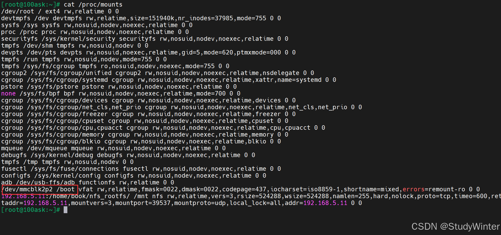

这里没问题，如果不是/boot分区，重新挂载

```bash
mount /dev/mmcblk2p2 /boot
```

把编译出来的设备树文件拷贝到/boot目录下

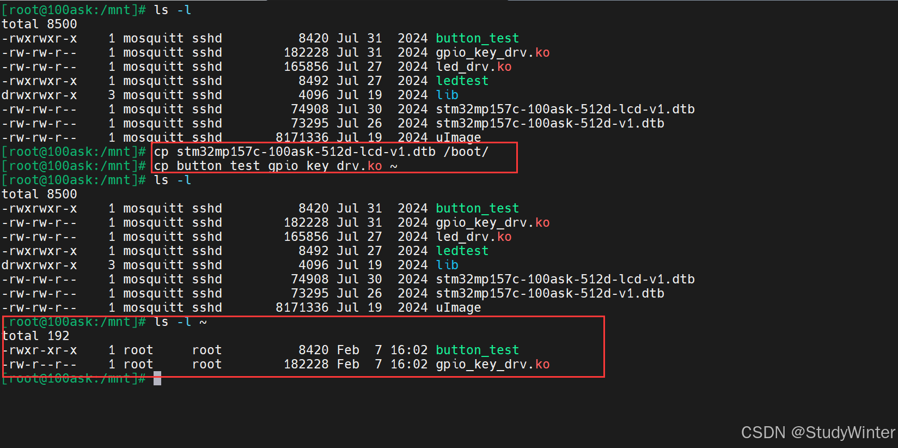

reboot重启

安装驱动，强制安装

```bash
insmod -f gpio_key_drv.ko
```

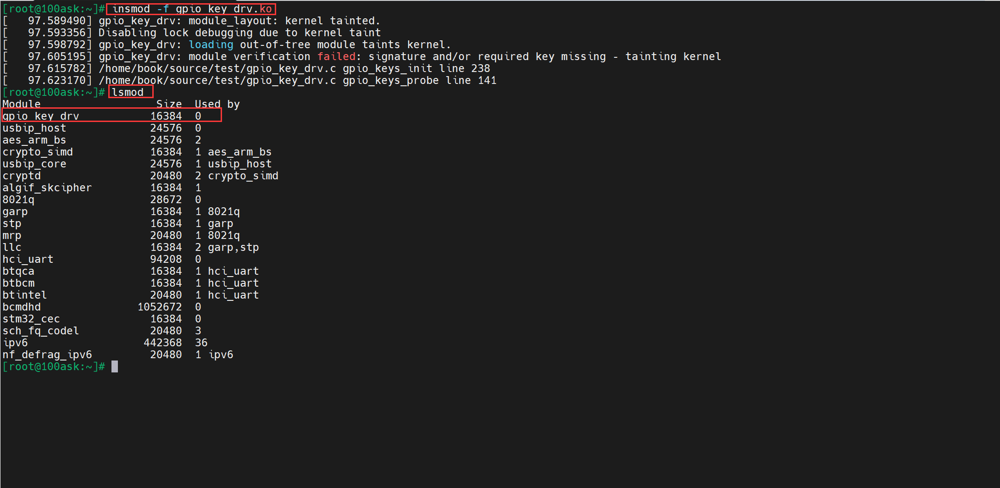

按按键测试，按下是1，松开是0

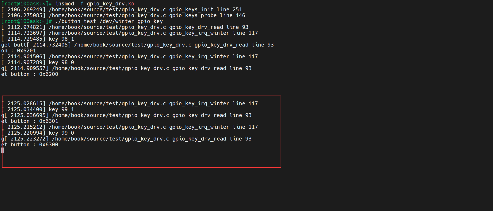

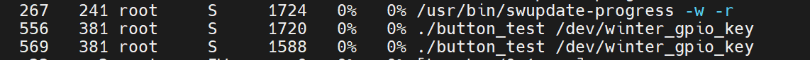

#### 2.3 总结

需求：在休眠唤醒的机制下，读取按键的数据，并且打印出来。

> ① APP调用read等函数试图读取数据，比如读取按键；
>
> ② APP进入内核态，也就是调用驱动中的对应函数，发现有数据则复制到用户空间并马上返回；
>
> ③ 如果APP在内核态，也就是在驱动程序中发现没有数据，则APP休眠；
>
> ④ 当有数据时，比如当按下按键时，驱动程序的中断服务程序被调用，它会记录数据、唤醒 APP；
>
> ⑤ APP继续运行它的内核态代码，也就是驱动程序中的函数，复制数据到用户空间并马上返回。

**①安装驱动的时候，调用的是gpio_keys_init函数和gpio_keys_probe函数，此时无数据，APP进入休眠状态；**

**②按下按键，进入gpio_key_irq_winter中断处理函数，记录数据，存到缓冲区中，唤醒线程；**

**③APP继续运行它的内核态代码，也就是驱动程序中的函数，循环队列不为空的时候，休眠被打断，获得数据，读出来；**

**④卸载驱动的时候，调用的是gpio_keys_exit和gpio_keys_remove函数。**

### 3 POLL机制

> 使用休眠-唤醒的方式等待某个事件发生时，有一个缺点： 等待的时间可能很久。可以加上一个超时时间，就可以使用 poll 机制。
>
> 步骤：
>
> ① APP不知道驱动程序中是否有数据，可以先调用poll函数查询一下，poll函数可以传入超时时间；
> ② APP进入内核态，调用到驱动程序的poll函数，如果有数据的话立刻返回；
> ③ 如果发现没有数据时就休眠一段时间；
> ④ 当有数据时，比如当按下按键时，驱动程序的中断服务程序被调用，它会记录数据、唤醒APP；
> ⑤ 当超时时间到了之后，内核也会唤醒 APP；
> ⑥ APP 根据poll函数的返回值就可以知道是否有数据，如果有数据就调用read得到数据。

#### 3.1 代码

##### gpio_key_drv.c

```cpp
#include <linux/module.h>

#include <linux/fs.h>
#include <linux/errno.h>
#include <linux/miscdevice.h>
#include <linux/kernel.h>
#include <linux/major.h>
#include <linux/mutex.h>
#include <linux/proc_fs.h>
#include <linux/seq_file.h>
#include <linux/stat.h>
#include <linux/init.h>
#include <linux/device.h>
#include <linux/tty.h>
#include <linux/kmod.h>
#include <linux/gfp.h>
#include <linux/gpio/consumer.h>
#include <linux/platform_device.h>
#include <linux/of_gpio.h>
#include <linux/of_irq.h>
#include <linux/interrupt.h>
#include <linux/irq.h>
#include <linux/slab.h>
#include <linux/poll.h>


// 2.1封装一个结构体
// 因为每个gpio都有这些属性，封装起来比较方便
struct gpio_key {
	int gpio;							// gpio编号
	int irq;							// 中断号
	enum of_gpio_flags flag;			// flag
	struct gpio_desc* gpiod;			// 描述
};

// 结构体指针
struct gpio_key* p_gpio_keys;
static int major = 0;
static struct class* gpio_key_class;

// 定义一个环形缓冲区存数据
#define BUF_LEN 128
static int g_keys[BUF_LEN];
static int r, w;

// 取下一个位置
#define NEXT_POS(x) ((x + 1) % BUF_LEN)

// 判断环形缓冲区是否为空
static int is_key_buf_empty(void)
{
	// 相等时为空
	return (r == w);
}

// 判断缓冲区是否满
static int is_key_buf_full(void)
{
	return (r == NEXT_POS(w));
}

// 写数据进去
static void put_key(int key)
{
	if (!is_key_buf_full())
	{
		g_keys[w] = key;
		// w后移
		w = NEXT_POS(w);
	}
}

// 获得数据
static int get_key(void)
{
	int key = 0;
	if (!is_key_buf_empty())
	{
		key = g_keys[r];
		// r后移
		r = NEXT_POS(r);
	}
	return key;
}


// 初始化等待队列
static DECLARE_WAIT_QUEUE_HEAD(gpio_key_wait);

// 2.3.1实现自己的read函数，等待按键按下
static ssize_t gpio_key_drv_read (struct file *file, char __user *buf, size_t size, loff_t *offset)
{
	int key;
	int err;
	printk("%s %s line %d\n", __FILE__, __FUNCTION__, __LINE__);
	// 数据从buf中读取
	// 当is_key_buf_empty为假时，也就是不空，休眠才被打断，才能get数据
	wait_event_interruptible(gpio_key_wait, !is_key_buf_empty());
	key = get_key();
	// 将数据拷贝给用户，即用户读数据
	err = copy_to_user(buf, &key, 4);
	return 4;
}

// 实现poll函数
static __poll_t gpio_key_drv_poll (struct file *file, struct poll_table_struct *pt)
{
	printk("%s %s line %d\n", __FILE__, __FUNCTION__, __LINE__);
	// 把当前线程挂到队列，并不会休眠
	poll_wait(file, &gpio_key_wait, pt);
	// 如果队列为空，就返回0，否则返回读到的数据
	return is_key_buf_empty() ? 0 : POLLIN | POLLRDBAND;
}


// 2.3 file_operations结构体
static struct file_operations gpio_key_drv = {
	.owner = THIS_MODULE,
	.read = gpio_key_drv_read,
	.poll = gpio_key_drv_poll,
};


// 2.2中断处理函数，唤醒线程
static irqreturn_t gpio_key_irq_winter(int irq, void *dev_id)
{
	struct gpio_key* gpio_key = dev_id;
	int val;
	int key;
	printk("%s %s line %d\n", __FILE__, __FUNCTION__, __LINE__);
	// 获取值
	val = gpiod_get_value(gpio_key->gpiod);
	// 输出key和对应的值
	printk("key %d %d\n", gpio_key->gpio, val);
	// 哪一个按键放在高8位，按下/松开是val
	key = (gpio_key->gpio << 8) | val;
	// 加入数据
	put_key(key);
	// 唤醒队列
	wake_up_interruptible(&gpio_key_wait);
	return IRQ_HANDLED;
}


// 2probe函数
/* a 从platform_device获得GPIO
 * b gpio=>irq，gpio资源转换成中断号
 * c request_irq
 */
int gpio_keys_probe(struct platform_device* pdev)
{
	int count, i;
	int err;
	unsigned flags = GPIOF_IN;
	enum of_gpio_flags flag;
	// platform_device转换成device_node
	struct device_node *node = pdev->dev.of_node;
	printk("%s %s line %d\n", __FILE__, __FUNCTION__, __LINE__);
	// a获得gpio
	count = of_gpio_count(node);
	if (count == 0)
	{
		printk("%s %s line %d, there isn't any gpio available\n", __FILE__, __FUNCTION__, __LINE__);
		return -1;
	}
	// 分配空间,内存情况k:kernel，z:zero
	p_gpio_keys = kzalloc(count * sizeof(struct gpio_key), GFP_KERNEL);

	// 针对每一个gpio操作
	for (i = 0; i < count; i++)
	{
		// b把设备结点中gpio的每个引脚都取出来，再转换成中断号
		p_gpio_keys[i].gpio = of_get_gpio_flags(node, i, &flag);
		if (p_gpio_keys[i].gpio < 0)
		{
			printk("%s %s line %d, of_get_gpio_flags fail\n", __FILE__, __FUNCTION__, __LINE__);
			return -1;
		}
		p_gpio_keys[i].gpiod = gpio_to_desc(p_gpio_keys[i].gpio);
		// 设备树中的flag:GPIO_ACTIVE_LOW & OF_GPIO_ACTIVE_LOW
		p_gpio_keys[i].flag = flag & OF_GPIO_ACTIVE_LOW;
		
		if (flag & OF_GPIO_ACTIVE_LOW)
		{
			flags |= GPIOF_ACTIVE_LOW;
		}
		// 申请并将gpio初始化为高电平
		err = devm_gpio_request_one(&pdev->dev, p_gpio_keys[i].gpio, flags, NULL);
		// 转换成中断号
		p_gpio_keys[i].irq = gpio_to_irq(p_gpio_keys[i].gpio);
	}

	// 当发生中断时，request_irq
	for (i = 0; i < count; i++)
	{
		// 双边沿触发，当发生irq中断时，内核会调用gpio_key_irq_winter中断处理函数，同时会把&p_gpio_keys[i])参数传进去
		err = request_irq(p_gpio_keys[i].irq, gpio_key_irq_winter, IRQF_TRIGGER_FALLING | IRQF_TRIGGER_RISING, "winter_gpio_key", &p_gpio_keys[i]);
	}

	// 注册file_operations结构体
	major = register_chrdev(0, "winter_gpio_key", &gpio_key_drv);
	// 注册结点
	gpio_key_class = class_create(THIS_MODULE, "winter_gpio_key_class");
	if (IS_ERR(gpio_key_class)) {
		printk("%s %s line %d\n", __FILE__, __FUNCTION__, __LINE__);
		unregister_chrdev(major, "winter_gpio_key");
		return PTR_ERR(gpio_key_class);
	}

	device_create(gpio_key_class, NULL, MKDEV(major, 0), NULL, "winter_gpio_key"); /* /dev/100ask_gpio_key */
	return 0;
}


// 3remove函数
int gpio_keys_remove(struct platform_device* pdev)
{
	struct device_node* node= pdev->dev.of_node;
	int count, i;
	printk("%s %s line %d\n", __FILE__, __FUNCTION__, __LINE__);

	device_destroy(gpio_key_class, MKDEV(major, 0));
	class_destroy(gpio_key_class);
	unregister_chrdev(major, "winter_gpio_key");

	// 释放每个gpio的空间
	count = of_gpio_count(node);
	for (i = 0; i < count; i++)
	{
		free_irq(p_gpio_keys[i].irq, &p_gpio_keys[i]);	
	}
	// 释放空间
	kfree(p_gpio_keys);
	return 0;
}


// 4资源
static const struct of_device_id winter_gpio_keys[] = {
	// 这里的数据和设备树的数据匹配
	{ .compatible = "winter,gpio_key" },
	{  },
};


// 1定义一个自己的platform_driver结构体
static struct platform_driver gpio_key_driver = {
	.driver = {
		.name		= "winter_gpio_keys",
		.of_match_table	= winter_gpio_keys,
	},
	.probe			= gpio_keys_probe,
	.remove			= gpio_keys_remove,
};


// 5入口函数和出口函数
static int __init gpio_keys_init(void)
{
	int err;
	printk("%s %s line %d\n", __FILE__, __FUNCTION__, __LINE__);
	// 注册platform结构体
	err = platform_driver_register(&gpio_key_driver);
	return 0;
}

// 出口函数
static void __exit gpio_keys_exit(void)
{
	printk("%s %s line %d\n", __FILE__, __FUNCTION__, __LINE__);
	// 注销platform_driver结构体
	platform_driver_unregister(&gpio_key_driver);
}

module_init(gpio_keys_init);
module_exit(gpio_keys_exit);
MODULE_LICENSE("GPL");


```

##### button_test.c

```cpp
#include <sys/types.h>
#include <sys/stat.h>
#include <fcntl.h>
#include <unistd.h>
#include <stdio.h>
#include <string.h>
#include <poll.h>


/*
 * ./button_test /dev/100ask_button0
 *
*/

int main(int argc, char** argv)
{
	int fd;
	int val;
	struct pollfd fds[1];
	int timeout_ms = 5000;					// 超时时间
	int res;

	// 判断参数
	if (argc != 2)
	{
		printf("Usage: %s <dev>\n", argv[0]);
		return -1;
	}

	// 打开文件
	fd = open(argv[1], O_RDWR);
	if (fd == -1)
	{
		printf("can not open file %s\n", argv[1]);
		return -1;
	}

	fds[0].fd = fd;					// 文件描述符赋值
	fds[0].events = POLLIN;			// 查询读事件

	while (1)
	{
		// 读文件
		res = poll(fds, 1, timeout_ms);
		// 返回值是正数，表示有多少个文件符合要求
		// 并且返回值是pollin
		if ((res == 1) && (fds[0].revents & POLLIN))
		{
			// 读数据
			read(fd, &val, 4);
			printf("get button: 0x%x\n", val);
		}
		else
		{
			// 超时
			printf("timeout: %d\n", timeout_ms);
		}
	}

	close(fd);
	return 0;
}


```

#### 3.2 测试

在开发板挂载 Ubuntu 的NFS目录

```bash
mount -t nfs -o nolock,vers=3 192.168.5.11:/home/book/nfs_rootfs/ /mnt
```

使用上面的设备树文件

先确定boot分区挂载在哪里

```bash
cat /proc/mounts
```


这里没问题，如果不是/boot分区，重新挂载

```bash
mount /dev/mmcblk2p2 /boot
```

把编译出来的设备树文件拷贝到/boot目录下


reboot重启

安装驱动，强制安装

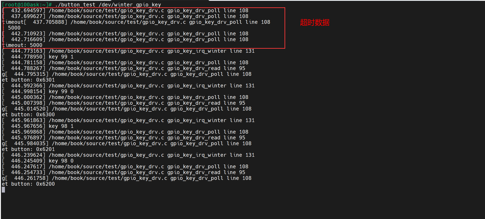

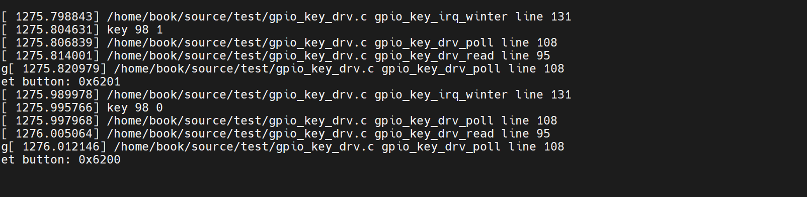

**什么都不做，5秒超时，调用两次drv_poll函数（打印两次）。按下按键后，则会打印数据。**

**第一次把线程放进wq队列，会调用drv_poll；第二次超时了，再次返回drv_poll中查看状态。**

#### 3.3 总结

> ③ APP调用poll之后，进入内核态；
>
> ④ 导致驱动程序的drv_poll被调用：
>
> 注意， drv_poll 要把自己这个线程挂入等待队列 wq 中；假设不放入队列里，那以后发生中断时，中断服务程序去哪里找到你嘛？
> drv_poll 还会判断一下：有没有数据啊？返回这个状态。
>
> ⑤ 假设当前没有数据，则休眠一会；
>
> ⑥ 在休眠过程中，一直没有按下了按键，超时时间到：内核把这个线程唤醒；
>
> ⑦ 线程从休眠中被唤醒，继续执行 for 循环，再次调用 drv_poll： drv_poll 返回数据状态
>
> ⑧ 哦，你还是没有数据，但是超时时间到了，那从内核态返回到应用态吧
>
> ⑨ APP 不能调用 read 函数读数据

**①安装驱动的时候，调用的是gpio_keys_init函数和gpio_keys_probe函数，此时无数据，APP进入休眠状态；**

**②drv_poll 要把自己这个线程挂入等待队列 wq 中，会调用drv_poll；第二次超时了，再次返回drv_poll中查看状态；**

**②按下按键，进入gpio_key_irq_winter中断处理函数，记录数据，存到缓冲区中，唤醒线程；**

**③APP继续运行它的内核态代码，也就是驱动程序中的函数，循环队列不为空的时候，休眠被打断，获得数据，读出数据；**

**④卸载驱动的时候，调用的是gpio_keys_exit和gpio_keys_remove函数。**

### 4 异步通知

> **① 谁发：驱动程序发**
> ② 发什么：信号
> **③ 发什么信号： SIGIO**
> ④ 怎么发：内核里提供有函数
> **⑤ 发给谁： APP， APP要把自己告诉驱动**
> **⑥ APP 收到后做什么：执行信号处理函数**
> ⑦ 信号处理函数和信号，之间怎么挂钩： APP 注册信号处理函数
>
> 
>
> a) 内核里有那么多驱动，你想让哪一个驱动给你发 SIGIO 信号？
>                 APP 要打开驱动程序的设备节点。
>
> b) 驱动程序怎么知道要发信号给你而不是别人？
>                 APP 要把自己的进程 ID 告诉驱动程序。
>
> c) APP 有时候想收到信号，有时候又不想收到信号：
>                 应该可以把 APP 的意愿告诉驱动。
>
> **驱动程序要做什么？发信号。**
>
> a) APP 设置进程 ID 时，驱动程序要记录下进程 ID；
>
> b) APP 还要使能驱动程序的异步通知功能，驱动中有对应的函数：
>
> c) APP 打开驱动程序时，内核会创建对应的 file 结构体， file 中有 f_flags；f_flags 中有一个 FASYNC 位，它被设置为 1 时表示使能异步通知功能。当 f_flags 中的 FASYNC 位发生变化时，驱动程序的 fasync 函数被调用。
>
> d) 发生中断时，有数据时，驱动程序调用内核辅助函数发信号。这个辅助函数名为 kill_fasync。

#### 4.1 代码

##### gpio_key_drv.c

```cpp
#include <linux/module.h>

#include <linux/fs.h>
#include <linux/errno.h>
#include <linux/miscdevice.h>
#include <linux/kernel.h>
#include <linux/major.h>
#include <linux/mutex.h>
#include <linux/proc_fs.h>
#include <linux/seq_file.h>
#include <linux/stat.h>
#include <linux/init.h>
#include <linux/device.h>
#include <linux/tty.h>
#include <linux/kmod.h>
#include <linux/gfp.h>
#include <linux/gpio/consumer.h>
#include <linux/platform_device.h>
#include <linux/of_gpio.h>
#include <linux/of_irq.h>
#include <linux/interrupt.h>
#include <linux/irq.h>
#include <linux/slab.h>
#include <linux/poll.h>
#include <linux/fcntl.h>


// 2.1封装一个结构体
// 因为每个gpio都有这些属性，封装起来比较方便
struct gpio_key {
	int gpio;							// gpio编号
	int irq;							// 中断号
	enum of_gpio_flags flag;			// flag
	struct gpio_desc* gpiod;			// 描述
};

// 结构体指针
struct gpio_key* p_gpio_keys;
static int major = 0;
static struct class* gpio_key_class;
static struct fasync_struct* button_fasync;

// 定义一个环形缓冲区存数据
#define BUF_LEN 128
static int g_keys[BUF_LEN];
static int r, w;

// 取下一个位置
#define NEXT_POS(x) ((x + 1) % BUF_LEN)

// 判断环形缓冲区是否为空
static int is_key_buf_empty(void)
{
	// 相等时为空
	return (r == w);
}

// 判断缓冲区是否满
static int is_key_buf_full(void)
{
	return (r == NEXT_POS(w));
}

// 写数据进去
static void put_key(int key)
{
	if (!is_key_buf_full())
	{
		g_keys[w] = key;
		// w后移
		w = NEXT_POS(w);
	}
}

// 获得数据
static int get_key(void)
{
	int key = 0;
	if (!is_key_buf_empty())
	{
		key = g_keys[r];
		// r后移
		r = NEXT_POS(r);
	}
	return key;
}


// 初始化等待队列
static DECLARE_WAIT_QUEUE_HEAD(gpio_key_wait);

// 2.3.1实现自己的read函数，等待按键按下
static ssize_t gpio_key_drv_read (struct file *file, char __user *buf, size_t size, loff_t *offset)
{
	int key;
	int err;
	printk("%s %s line %d\n", __FILE__, __FUNCTION__, __LINE__);
	// 数据从buf中读取
	// 当is_key_buf_empty为假时，也就是不空，休眠才被打断，才能get数据
	wait_event_interruptible(gpio_key_wait, !is_key_buf_empty());
	key = get_key();
	// 将数据拷贝给用户，即用户读数据
	err = copy_to_user(buf, &key, 4);
	return 4;
}

// 实现poll函数

static __poll_t gpio_key_drv_poll (struct file *file, struct poll_table_struct *pt)
{
	printk("%s %s line %d\n", __FILE__, __FUNCTION__, __LINE__);
	// 把当前线程挂到队列，并不会休眠
	poll_wait(file, &gpio_key_wait, pt);
	// 如果队列为空，就返回0，否则返回读到的数据
	return is_key_buf_empty() ? 0 : POLLIN | POLLRDBAND;
}


// 实现fasync函数
int gpio_key_drv_fasync (int fd, struct file *file, int on)
{
	if (fasync_helper(fd, file, on, &button_fasync) >= 0)
	{
		return 0;
	}
	return -EIO;
}


// 2.3 file_operations结构体
static struct file_operations gpio_key_drv = {
	.owner = THIS_MODULE,
	.read = gpio_key_drv_read,
	.poll = gpio_key_drv_poll,
	.fasync = gpio_key_drv_fasync,
};


// 2.2中断处理函数，唤醒线程
static irqreturn_t gpio_key_irq_winter(int irq, void *dev_id)
{
	struct gpio_key* gpio_key = dev_id;
	int val;
	int key;
	printk("%s %s line %d\n", __FILE__, __FUNCTION__, __LINE__);
	// 获取值
	val = gpiod_get_value(gpio_key->gpiod);
	// 输出key和对应的值
	printk("key %d %d\n", gpio_key->gpio, val);
	// 哪一个按键放在高8位，按下/松开是val
	key = (gpio_key->gpio << 8) | val;
	// 加入数据
	put_key(key);
	// 唤醒队列
	wake_up_interruptible(&gpio_key_wait);
	// 中断函数中使用kill_fasync发送信号
	kill_fasync(&button_fasync, SIGIO, POLL_IN);
	return IRQ_HANDLED;
}


// 2probe函数
/* a 从platform_device获得GPIO
 * b gpio=>irq，gpio资源转换成中断号
 * c request_irq
 */
int gpio_keys_probe(struct platform_device* pdev)
{
	int count, i;
	int err;
	unsigned flags = GPIOF_IN;
	enum of_gpio_flags flag;
	// platform_device转换成device_node
	struct device_node *node = pdev->dev.of_node;
	printk("%s %s line %d\n", __FILE__, __FUNCTION__, __LINE__);
	// a获得gpio
	count = of_gpio_count(node);
	if (count == 0)
	{
		printk("%s %s line %d, there isn't any gpio available\n", __FILE__, __FUNCTION__, __LINE__);
		return -1;
	}
	// 分配空间,内存情况k:kernel，z:zero
	p_gpio_keys = kzalloc(count * sizeof(struct gpio_key), GFP_KERNEL);

	// 针对每一个gpio操作
	for (i = 0; i < count; i++)
	{
		// b把设备结点中gpio的每个引脚都取出来，再转换成中断号
		p_gpio_keys[i].gpio = of_get_gpio_flags(node, i, &flag);
		if (p_gpio_keys[i].gpio < 0)
		{
			printk("%s %s line %d, of_get_gpio_flags fail\n", __FILE__, __FUNCTION__, __LINE__);
			return -1;
		}
		p_gpio_keys[i].gpiod = gpio_to_desc(p_gpio_keys[i].gpio);
		// 设备树中的flag:GPIO_ACTIVE_LOW & OF_GPIO_ACTIVE_LOW
		p_gpio_keys[i].flag = flag & OF_GPIO_ACTIVE_LOW;
		
		if (flag & OF_GPIO_ACTIVE_LOW)
		{
			flags |= GPIOF_ACTIVE_LOW;
		}
		// 申请并将gpio初始化为高电平
		err = devm_gpio_request_one(&pdev->dev, p_gpio_keys[i].gpio, flags, NULL);
		// 转换成中断号
		p_gpio_keys[i].irq = gpio_to_irq(p_gpio_keys[i].gpio);
	}

	// 当发生中断时，request_irq
	for (i = 0; i < count; i++)
	{
		// 双边沿触发，当发生irq中断时，内核会调用gpio_key_irq_winter中断处理函数，同时会把&p_gpio_keys[i])参数传进去
		err = request_irq(p_gpio_keys[i].irq, gpio_key_irq_winter, IRQF_TRIGGER_FALLING | IRQF_TRIGGER_RISING, "winter_gpio_key", &p_gpio_keys[i]);
	}

	// 注册file_operations结构体
	major = register_chrdev(0, "winter_gpio_key", &gpio_key_drv);
	// 注册结点
	gpio_key_class = class_create(THIS_MODULE, "winter_gpio_key_class");
	if (IS_ERR(gpio_key_class)) {
		printk("%s %s line %d\n", __FILE__, __FUNCTION__, __LINE__);
		unregister_chrdev(major, "winter_gpio_key");
		return PTR_ERR(gpio_key_class);
	}

	device_create(gpio_key_class, NULL, MKDEV(major, 0), NULL, "winter_gpio_key"); /* /dev/100ask_gpio_key */
	return 0;
}


// 3remove函数
int gpio_keys_remove(struct platform_device* pdev)
{
	struct device_node* node= pdev->dev.of_node;
	int count, i;
	printk("%s %s line %d\n", __FILE__, __FUNCTION__, __LINE__);

	device_destroy(gpio_key_class, MKDEV(major, 0));
	class_destroy(gpio_key_class);
	unregister_chrdev(major, "winter_gpio_key");

	// 释放每个gpio的空间
	count = of_gpio_count(node);
	for (i = 0; i < count; i++)
	{
		free_irq(p_gpio_keys[i].irq, &p_gpio_keys[i]);	
	}
	// 释放空间
	kfree(p_gpio_keys);
	return 0;
}


// 4资源
static const struct of_device_id winter_gpio_keys[] = {
	// 这里的数据和设备树的数据匹配
	{ .compatible = "winter,gpio_key" },
	{  },
};


// 1定义一个自己的platform_driver结构体
static struct platform_driver gpio_key_driver = {
	.driver = {
		.name		= "winter_gpio_keys",
		.of_match_table	= winter_gpio_keys,
	},
	.probe			= gpio_keys_probe,
	.remove			= gpio_keys_remove,
};


// 5入口函数和出口函数
static int __init gpio_keys_init(void)
{
	int err;
	printk("%s %s line %d\n", __FILE__, __FUNCTION__, __LINE__);
	// 注册platform结构体
	err = platform_driver_register(&gpio_key_driver);
	return 0;
}

// 出口函数
static void __exit gpio_keys_exit(void)
{
	printk("%s %s line %d\n", __FILE__, __FUNCTION__, __LINE__);
	// 注销platform_driver结构体
	platform_driver_unregister(&gpio_key_driver);
}

module_init(gpio_keys_init);
module_exit(gpio_keys_exit);
MODULE_LICENSE("GPL");


```

##### button_test.c

```cpp
#include <sys/types.h>
#include <sys/stat.h>
#include <fcntl.h>
#include <unistd.h>
#include <stdio.h>
#include <string.h>
#include <poll.h>
#include <signal.h>


/*
 * ./button_test /dev/100ask_button0
 *
*/
static int fd;

// 2信号处理函数
static void sig_func(int sig)
{
	int val;
	// 读数据
	read(fd, &val, 4);
	printf("get button: 0x%x\n", val);
}


int main(int argc, char** argv)
{
	int flags;
	
	// 1判断参数
	if (argc != 2)
	{
		printf("Usage: %s <dev>\n", argv[0]);
		return -1;
	}

	// 2注册信号处理函数
	signal(SIGIO, sig_func);

	// 3打开文件
	fd = open(argv[1], O_RDWR);
	if (fd == -1)
	{
		printf("can not open file %s\n", argv[1]);
		return -1;
	}

	// 4把APP的pid告诉驱动程序
	fcntl(fd, F_SETOWN, getpid());

	// 5读取驱动程序的flags，并设置FASYNC位为1
	flags = fcntl(fd, F_SETFL, flags | FASYNC);

	while (1)
	{
		printf("https://blog.csdn.net/Zhouzi_heng\n");
		sleep(2);
	}

	close(fd);
	return 0;
}


```

#### 4.2 测试

在开发板挂载 Ubuntu 的NFS目录

```bash
mount -t nfs -o nolock,vers=3 192.168.5.11:/home/book/nfs_rootfs/ /mnt
```

使用上面的设备树文件

先确定boot分区挂载在哪里

```bash
cat /proc/mounts
```


这里没问题，如果不是/boot分区，重新挂载

```bash
mount /dev/mmcblk2p2 /boot
```

把编译出来的设备树文件拷贝到/boot目录下


reboot重启

安装驱动，强制安装

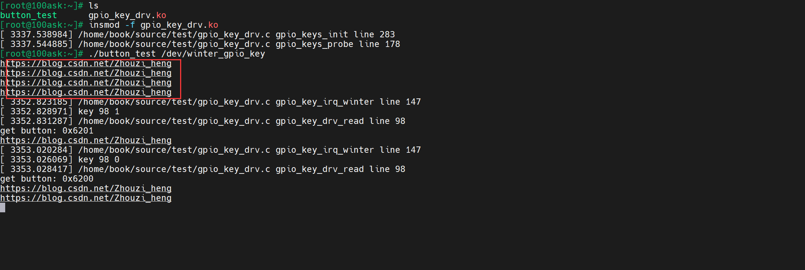

每2秒输出我的博客地址，按下按键后输出中断打印信息。这里poll的代码也在，看样子异步的优先级高于poll。

#### 4.3 总结

> 应用层需要做的：
>
> **①写信号处理函数；**
>
> **②注册信号处理函数；**
>
> **③打开文件；**
>
> **④把APP的pid告诉驱动程序；**
>
> **⑤读取驱动程序flag并设置FASYNC位为1**
>
> 驱动层需要做的：
>
> **①提供对应的fasync函数，并调用fasync_helper函数；**
>
> **②中断处理函数中使用kill fasync发送信号。**

### 5 阻塞与非阻塞

所谓阻塞，就是等待某件事情发生。比如调用read读取按键时，如果没有按键数据则 read 函数不会返回，它会让线程休眠等待。

使用 poll 时，如果传入的超时时间不为 0，这种访问方法也是阻塞的。
**使用 poll 时，可以设置超时时间为 0，这样即使没有数据它也会立刻返回，这就是非阻塞方式**。能不能让 read 函数既能工作于阻塞方式，也可以工作于非阻塞方式？ 可以！

**APP 调用open函数时，传入O_NONBLOCK，就表示要使用非阻塞方式；默认是阻塞方式。**

#### 5.1 代码

##### gpio_key_drv.c

```cpp
#include <linux/module.h>

#include <linux/fs.h>
#include <linux/errno.h>
#include <linux/miscdevice.h>
#include <linux/kernel.h>
#include <linux/major.h>
#include <linux/mutex.h>
#include <linux/proc_fs.h>
#include <linux/seq_file.h>
#include <linux/stat.h>
#include <linux/init.h>
#include <linux/device.h>
#include <linux/tty.h>
#include <linux/kmod.h>
#include <linux/gfp.h>
#include <linux/gpio/consumer.h>
#include <linux/platform_device.h>
#include <linux/of_gpio.h>
#include <linux/of_irq.h>
#include <linux/interrupt.h>
#include <linux/irq.h>
#include <linux/slab.h>
#include <linux/poll.h>
#include <linux/fcntl.h>


// 2.1封装一个结构体
// 因为每个gpio都有这些属性，封装起来比较方便
struct gpio_key {
	int gpio;							// gpio编号
	int irq;							// 中断号
	enum of_gpio_flags flag;			// flag
	struct gpio_desc* gpiod;			// 描述
};

// 结构体指针
struct gpio_key* p_gpio_keys;
static int major = 0;
static struct class* gpio_key_class;
static struct fasync_struct* button_fasync;

// 定义一个环形缓冲区存数据
#define BUF_LEN 128
static int g_keys[BUF_LEN];
static int r, w;

// 取下一个位置
#define NEXT_POS(x) ((x + 1) % BUF_LEN)

// 判断环形缓冲区是否为空
static int is_key_buf_empty(void)
{
	// 相等时为空
	return (r == w);
}

// 判断缓冲区是否满
static int is_key_buf_full(void)
{
	return (r == NEXT_POS(w));
}

// 写数据进去
static void put_key(int key)
{
	if (!is_key_buf_full())
	{
		g_keys[w] = key;
		// w后移
		w = NEXT_POS(w);
	}
}

// 获得数据
static int get_key(void)
{
	int key = 0;
	if (!is_key_buf_empty())
	{
		key = g_keys[r];
		// r后移
		r = NEXT_POS(r);
	}
	return key;
}


// 初始化等待队列
static DECLARE_WAIT_QUEUE_HEAD(gpio_key_wait);

// 2.3.1实现自己的read函数，等待按键按下
static ssize_t gpio_key_drv_read (struct file *file, char __user *buf, size_t size, loff_t *offset)
{
	int key;
	int err;
	printk("%s %s line %d\n", __FILE__, __FUNCTION__, __LINE__);
	// 加入阻塞
	// 环形缓冲区是空的 && 不阻塞
	if (is_key_buf_empty() && (file->f_flags & O_NONBLOCK))
	{
		return -EAGAIN;
	}

	
	// 数据从buf中读取
	// 当is_key_buf_empty为假时，也就是不空，休眠才被打断，才能get数据
	wait_event_interruptible(gpio_key_wait, !is_key_buf_empty());
	key = get_key();
	// 将数据拷贝给用户，即用户读数据
	err = copy_to_user(buf, &key, 4);
	return 4;
}

// 实现poll函数

static __poll_t gpio_key_drv_poll (struct file *file, struct poll_table_struct *pt)
{
	printk("%s %s line %d\n", __FILE__, __FUNCTION__, __LINE__);
	// 把当前线程挂到队列，并不会休眠
	poll_wait(file, &gpio_key_wait, pt);
	// 如果队列为空，就返回0，否则返回读到的数据
	return is_key_buf_empty() ? 0 : POLLIN | POLLRDBAND;
}


// 实现fasync函数
int gpio_key_drv_fasync (int fd, struct file *file, int on)
{
	if (fasync_helper(fd, file, on, &button_fasync) >= 0)
	{
		return 0;
	}
	return -EIO;
}


// 2.3 file_operations结构体
static struct file_operations gpio_key_drv = {
	.owner = THIS_MODULE,
	.read = gpio_key_drv_read,
	.poll = gpio_key_drv_poll,
	.fasync = gpio_key_drv_fasync,
};


// 2.2中断处理函数，唤醒线程
static irqreturn_t gpio_key_irq_winter(int irq, void *dev_id)
{
	struct gpio_key* gpio_key = dev_id;
	int val;
	int key;
	printk("%s %s line %d\n", __FILE__, __FUNCTION__, __LINE__);
	// 获取值
	val = gpiod_get_value(gpio_key->gpiod);
	// 输出key和对应的值
	printk("key %d %d\n", gpio_key->gpio, val);
	// 哪一个按键放在高8位，按下/松开是val
	key = (gpio_key->gpio << 8) | val;
	// 加入数据
	put_key(key);
	// 唤醒队列
	wake_up_interruptible(&gpio_key_wait);
	// 中断函数中使用kill_fasync发送信号
	kill_fasync(&button_fasync, SIGIO, POLL_IN);
	return IRQ_HANDLED;
}


// 2probe函数
/* a 从platform_device获得GPIO
 * b gpio=>irq，gpio资源转换成中断号
 * c request_irq
 */
int gpio_keys_probe(struct platform_device* pdev)
{
	int count, i;
	int err;
	unsigned flags = GPIOF_IN;
	enum of_gpio_flags flag;
	// platform_device转换成device_node
	struct device_node *node = pdev->dev.of_node;
	printk("%s %s line %d\n", __FILE__, __FUNCTION__, __LINE__);
	// a获得gpio
	count = of_gpio_count(node);
	if (count == 0)
	{
		printk("%s %s line %d, there isn't any gpio available\n", __FILE__, __FUNCTION__, __LINE__);
		return -1;
	}
	// 分配空间,内存情况k:kernel，z:zero
	p_gpio_keys = kzalloc(count * sizeof(struct gpio_key), GFP_KERNEL);

	// 针对每一个gpio操作
	for (i = 0; i < count; i++)
	{
		// b把设备结点中gpio的每个引脚都取出来，再转换成中断号
		p_gpio_keys[i].gpio = of_get_gpio_flags(node, i, &flag);
		if (p_gpio_keys[i].gpio < 0)
		{
			printk("%s %s line %d, of_get_gpio_flags fail\n", __FILE__, __FUNCTION__, __LINE__);
			return -1;
		}
		p_gpio_keys[i].gpiod = gpio_to_desc(p_gpio_keys[i].gpio);
		// 设备树中的flag:GPIO_ACTIVE_LOW & OF_GPIO_ACTIVE_LOW
		p_gpio_keys[i].flag = flag & OF_GPIO_ACTIVE_LOW;
		
		if (flag & OF_GPIO_ACTIVE_LOW)
		{
			flags |= GPIOF_ACTIVE_LOW;
		}
		// 申请并将gpio初始化为高电平
		err = devm_gpio_request_one(&pdev->dev, p_gpio_keys[i].gpio, flags, NULL);
		// 转换成中断号
		p_gpio_keys[i].irq = gpio_to_irq(p_gpio_keys[i].gpio);
	}

	// 当发生中断时，request_irq
	for (i = 0; i < count; i++)
	{
		// 双边沿触发，当发生irq中断时，内核会调用gpio_key_irq_winter中断处理函数，同时会把&p_gpio_keys[i])参数传进去
		err = request_irq(p_gpio_keys[i].irq, gpio_key_irq_winter, IRQF_TRIGGER_FALLING | IRQF_TRIGGER_RISING, "winter_gpio_key", &p_gpio_keys[i]);
	}

	// 注册file_operations结构体
	major = register_chrdev(0, "winter_gpio_key", &gpio_key_drv);
	// 注册结点
	gpio_key_class = class_create(THIS_MODULE, "winter_gpio_key_class");
	if (IS_ERR(gpio_key_class)) {
		printk("%s %s line %d\n", __FILE__, __FUNCTION__, __LINE__);
		unregister_chrdev(major, "winter_gpio_key");
		return PTR_ERR(gpio_key_class);
	}

	device_create(gpio_key_class, NULL, MKDEV(major, 0), NULL, "winter_gpio_key"); /* /dev/100ask_gpio_key */
	return 0;
}


// 3remove函数
int gpio_keys_remove(struct platform_device* pdev)
{
	struct device_node* node= pdev->dev.of_node;
	int count, i;
	printk("%s %s line %d\n", __FILE__, __FUNCTION__, __LINE__);

	device_destroy(gpio_key_class, MKDEV(major, 0));
	class_destroy(gpio_key_class);
	unregister_chrdev(major, "winter_gpio_key");

	// 释放每个gpio的空间
	count = of_gpio_count(node);
	for (i = 0; i < count; i++)
	{
		free_irq(p_gpio_keys[i].irq, &p_gpio_keys[i]);	
	}
	// 释放空间
	kfree(p_gpio_keys);
	return 0;
}


// 4资源
static const struct of_device_id winter_gpio_keys[] = {
	// 这里的数据和设备树的数据匹配
	{ .compatible = "winter,gpio_key" },
	{  },
};


// 1定义一个自己的platform_driver结构体
static struct platform_driver gpio_key_driver = {
	.driver = {
		.name		= "winter_gpio_keys",
		.of_match_table	= winter_gpio_keys,
	},
	.probe			= gpio_keys_probe,
	.remove			= gpio_keys_remove,
};


// 5入口函数和出口函数
static int __init gpio_keys_init(void)
{
	int err;
	printk("%s %s line %d\n", __FILE__, __FUNCTION__, __LINE__);
	// 注册platform结构体
	err = platform_driver_register(&gpio_key_driver);
	return 0;
}

// 出口函数
static void __exit gpio_keys_exit(void)
{
	printk("%s %s line %d\n", __FILE__, __FUNCTION__, __LINE__);
	// 注销platform_driver结构体
	platform_driver_unregister(&gpio_key_driver);
}

module_init(gpio_keys_init);
module_exit(gpio_keys_exit);
MODULE_LICENSE("GPL");


```

和上一节相比，在read函数中增加了判断不阻塞

##### button_test.c

```cpp
#include <sys/types.h>
#include <sys/stat.h>
#include <fcntl.h>
#include <unistd.h>
#include <stdio.h>
#include <string.h>
#include <poll.h>
#include <signal.h>


/*
 * ./button_test /dev/100ask_button0
 *
*/

int main(int argc, char** argv)
{
	int flags;
	int i, val;
	int fd;
	
	// 1判断参数
	if (argc != 2)
	{
		printf("Usage: %s <dev>\n", argv[0]);
		return -1;
	}


	// 2打开文件-默认是阻塞的，这里是非阻塞
	fd = open(argv[1], O_RDWR | O_NONBLOCK);
	if (fd == -1)
	{
		printf("can not open file %s\n", argv[1]);
		return -1;
	}

	// 以非阻塞的方式读10次，这里会立即执行
	for (i = 0; i < 10; i++)
	{
		if (read(fd, &val, 4) == 4)
		{
			printf("get button: 0x%x\n", val);
		}
		else
		{
			printf("get button: -1\n");
		}
	}

	// 读取驱动程序flag并设置成阻塞方式
	flags = fcntl(fd, F_GETFL);
	fcntl(fd, F_SETFL, flags & ~O_NONBLOCK);

	while (1)
	{
		// 这里就是阻塞方式读数据了
		if (read(fd, &val, 4) == 4)
		{
			printf("get button: 0x%x\n", val);
		}
		else
		{
			printf("while get button: -1\n");
		}
	}

	close(fd);
	return 0;
}


```

这里先以非阻塞的方式打开，因为没有数据，所以会读10次数据；之后是阻塞方式读，有按键才会有数据。

#### 5.2 测试

在开发板挂载 Ubuntu 的NFS目录

```bash
mount -t nfs -o nolock,vers=3 192.168.5.11:/home/book/nfs_rootfs/ /mnt
```

使用上面的设备树文件

先确定boot分区挂载在哪里

```bash
cat /proc/mounts
```


这里没问题，如果不是/boot分区，重新挂载

```bash
mount /dev/mmcblk2p2 /boot
```

把编译出来的设备树文件拷贝到/boot目录下


reboot重启

安装驱动，强制安装

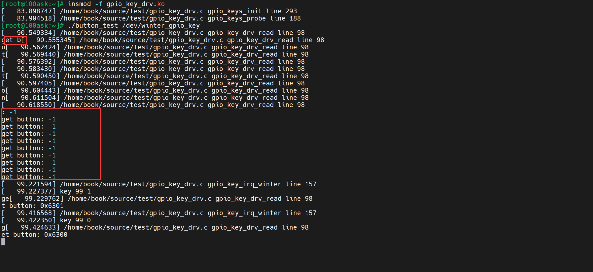

这里先以非阻塞的方式打开，因为没有数据，所以会读10次数据；之后是阻塞方式读，有按键才会有数据。

#### 5.3 总结

这里先以非阻塞的方式打开，因为没有数据，所以会读10次数据；之后是阻塞方式读，有按键才会有数据。

### 6 定时器

所谓定时器，就是闹钟，时间到后你就要做某些事。有2个要素：时间、做事，换成程序员的话就是：超时时间、函数。

> 按下或松开一个按键，它的 GPIO 电平会反复变化，最后才稳定。一般是几十毫秒才会稳定。如果不处理抖动的话，用户只操作一次按键，中断程序可能会上报多个数据。怎么处理？
>
> 核心在于：在 GPIO 中断中并不立刻记录按键值，而是修改定时器超时时间，10ms 后再处理。
>
> a) 如果 10ms 内又发生了 GPIO 中断，那就认为是抖动，这时再次修改超时时间为 10ms。
> b) 只有 10ms 之内再无 GPIO 中断发生，那么定时器的函数才会被调用。在定时器函数中记录按键值。

#### 6.1 代码

（1）在原来的gpio_key结构体中添加一个定时器，每个按键都有一个定时器；在probe设置定时器、设置超时时间、添加定时器；在remove函数中删除定时器；

（2）在超时处理函数中发送信号；

（3）在中断服务程序，修改定时器时间

##### gpio_key_drv.c

```cpp
#include <linux/module.h>

#include <linux/fs.h>
#include <linux/errno.h>
#include <linux/miscdevice.h>
#include <linux/kernel.h>
#include <linux/major.h>
#include <linux/mutex.h>
#include <linux/proc_fs.h>
#include <linux/seq_file.h>
#include <linux/stat.h>
#include <linux/init.h>
#include <linux/device.h>
#include <linux/tty.h>
#include <linux/kmod.h>
#include <linux/gfp.h>
#include <linux/gpio/consumer.h>
#include <linux/platform_device.h>
#include <linux/of_gpio.h>
#include <linux/of_irq.h>
#include <linux/interrupt.h>
#include <linux/irq.h>
#include <linux/slab.h>
#include <linux/poll.h>
#include <linux/fcntl.h>
#include <linux/timer.h>


// 2.1封装一个结构体
// 因为每个gpio都有这些属性，封装起来比较方便
struct gpio_key {
	int gpio;							// gpio编号
	int irq;							// 中断号
	enum of_gpio_flags flag;			// flag
	struct gpio_desc* gpiod;			// 描述
	struct timer_list key_timer;		// 每个按键都有一个定时器
};

// 结构体指针
struct gpio_key* p_gpio_keys;
static int major = 0;
static struct class* gpio_key_class;
static struct fasync_struct* button_fasync;

// 定义一个环形缓冲区存数据
#define BUF_LEN 128
static int g_keys[BUF_LEN];
static int r, w;

// 取下一个位置
#define NEXT_POS(x) ((x + 1) % BUF_LEN)

// 判断环形缓冲区是否为空
static int is_key_buf_empty(void)
{
	// 相等时为空
	return (r == w);
}

// 判断缓冲区是否满
static int is_key_buf_full(void)
{
	return (r == NEXT_POS(w));
}

// 写数据进去
static void put_key(int key)
{
	if (!is_key_buf_full())
	{
		g_keys[w] = key;
		// w后移
		w = NEXT_POS(w);
	}
}

// 获得数据
static int get_key(void)
{
	int key = 0;
	if (!is_key_buf_empty())
	{
		key = g_keys[r];
		// r后移
		r = NEXT_POS(r);
	}
	return key;
}


// 初始化等待队列
static DECLARE_WAIT_QUEUE_HEAD(gpio_key_wait);

// 2.3.1实现自己的read函数，等待按键按下
static ssize_t gpio_key_drv_read (struct file *file, char __user *buf, size_t size, loff_t *offset)
{
	int key;
	int err;
	printk("%s %s line %d\n", __FILE__, __FUNCTION__, __LINE__);
	// 加入阻塞
	// 环形缓冲区是空的 && 不阻塞
	if (is_key_buf_empty() && (file->f_flags & O_NONBLOCK))
	{
		return -EAGAIN;
	}

	
	// 数据从buf中读取
	// 当is_key_buf_empty为假时，也就是不空，休眠才被打断，才能get数据
	wait_event_interruptible(gpio_key_wait, !is_key_buf_empty());
	key = get_key();
	// 将数据拷贝给用户，即用户读数据
	err = copy_to_user(buf, &key, 4);
	return 4;
}

// 实现poll函数

static __poll_t gpio_key_drv_poll (struct file *file, struct poll_table_struct *pt)
{
	printk("%s %s line %d\n", __FILE__, __FUNCTION__, __LINE__);
	// 把当前线程挂到队列，并不会休眠
	poll_wait(file, &gpio_key_wait, pt);
	// 如果队列为空，就返回0，否则返回读到的数据
	return is_key_buf_empty() ? 0 : POLLIN | POLLRDBAND;
}


// 实现fasync函数
int gpio_key_drv_fasync (int fd, struct file *file, int on)
{
	if (fasync_helper(fd, file, on, &button_fasync) >= 0)
	{
		return 0;
	}
	return -EIO;
}


// 定时器超时函数，发送信号
void key_timer_expire(struct timer_list *list)
{
	int val;
	int key;
	printk("%s %s line %d\n", __FILE__, __FUNCTION__, __LINE__);
	/* data ==> gpio */
	// 从结构体变量地址反算出整个结构体的地址
	struct gpio_key* gpio_key = from_timer(gpio_key, list, key_timer);

	val = gpiod_get_value(gpio_key->gpiod);
	printk("key %d %d\n", gpio_key->gpio, val);
	// 哪一个按键放在高8位，按下/松开是val
	key = (gpio_key->gpio << 8) | val;
	// 加入数据
	put_key(key);
	
	// 唤醒g_key队列
	wake_up_interruptible(&gpio_key_wait);
	// 中断处理函数中使用kill_fasync发送信号
	kill_fasync(&button_fasync, SIGIO, POLL_IN);
}


// 2.3 file_operations结构体
static struct file_operations gpio_key_drv = {
	.owner = THIS_MODULE,
	.read = gpio_key_drv_read,
	.poll = gpio_key_drv_poll,
	.fasync = gpio_key_drv_fasync,
};


// 2.2中断处理函数，修改定时器时间
static irqreturn_t gpio_key_irq_winter(int irq, void *dev_id)
{
	struct gpio_key *gpio_key = dev_id;
	printk("%s %s line %d\n", __FILE__, __FUNCTION__, __LINE__);
	mod_timer(&gpio_key->key_timer, jiffies + HZ / 50);    // 20ms
	return IRQ_HANDLED;
}


// 2probe函数
/* a 从platform_device获得GPIO
 * b gpio=>irq，gpio资源转换成中断号
 * c request_irq
 */
int gpio_keys_probe(struct platform_device* pdev)
{
	int count, i;
	int err;
	unsigned flags = GPIOF_IN;
	enum of_gpio_flags flag;
	// platform_device转换成device_node
	struct device_node *node = pdev->dev.of_node;
	printk("%s %s line %d\n", __FILE__, __FUNCTION__, __LINE__);
	// a获得gpio
	count = of_gpio_count(node);
	if (count == 0)
	{
		printk("%s %s line %d, there isn't any gpio available\n", __FILE__, __FUNCTION__, __LINE__);
		return -1;
	}
	// 分配空间,内存情况k:kernel，z:zero
	p_gpio_keys = kzalloc(count * sizeof(struct gpio_key), GFP_KERNEL);

	// 针对每一个gpio操作
	for (i = 0; i < count; i++)
	{
		// b把设备结点中gpio的每个引脚都取出来，再转换成中断号
		p_gpio_keys[i].gpio = of_get_gpio_flags(node, i, &flag);
		if (p_gpio_keys[i].gpio < 0)
		{
			printk("%s %s line %d, of_get_gpio_flags fail\n", __FILE__, __FUNCTION__, __LINE__);
			return -1;
		}
		p_gpio_keys[i].gpiod = gpio_to_desc(p_gpio_keys[i].gpio);
		// 设备树中的flag:GPIO_ACTIVE_LOW & OF_GPIO_ACTIVE_LOW
		p_gpio_keys[i].flag = flag & OF_GPIO_ACTIVE_LOW;
		
		if (flag & OF_GPIO_ACTIVE_LOW)
		{
			flags |= GPIOF_ACTIVE_LOW;
		}
		// 申请并将gpio初始化为高电平
		err = devm_gpio_request_one(&pdev->dev, p_gpio_keys[i].gpio, flags, NULL);
		// 转换成中断号
		p_gpio_keys[i].irq = gpio_to_irq(p_gpio_keys[i].gpio);

		// 设置定时器,key_timer_expire是回调函数
		timer_setup(&p_gpio_keys[i].key_timer, key_timer_expire, 0);
		// 设置超时时间，最大值
		p_gpio_keys[i].key_timer.expires = ~0;
		// 添加定时器
		add_timer(&p_gpio_keys[i].key_timer);
		
	}

	// 当发生中断时，request_irq
	for (i = 0; i < count; i++)
	{
		// 双边沿触发，当发生irq中断时，内核会调用gpio_key_irq_winter中断处理函数，同时会把&p_gpio_keys[i])参数传进去
		err = request_irq(p_gpio_keys[i].irq, gpio_key_irq_winter, IRQF_TRIGGER_FALLING | IRQF_TRIGGER_RISING, "winter_gpio_key", &p_gpio_keys[i]);
	}

	// 注册file_operations结构体
	major = register_chrdev(0, "winter_gpio_key", &gpio_key_drv);
	// 注册结点
	gpio_key_class = class_create(THIS_MODULE, "winter_gpio_key_class");
	if (IS_ERR(gpio_key_class)) {
		printk("%s %s line %d\n", __FILE__, __FUNCTION__, __LINE__);
		unregister_chrdev(major, "winter_gpio_key");
		return PTR_ERR(gpio_key_class);
	}

	device_create(gpio_key_class, NULL, MKDEV(major, 0), NULL, "winter_gpio_key"); /* /dev/100ask_gpio_key */
	return 0;
}


// 3remove函数
int gpio_keys_remove(struct platform_device* pdev)
{
	struct device_node* node= pdev->dev.of_node;
	int count, i;
	printk("%s %s line %d\n", __FILE__, __FUNCTION__, __LINE__);

	device_destroy(gpio_key_class, MKDEV(major, 0));
	class_destroy(gpio_key_class);
	unregister_chrdev(major, "winter_gpio_key");

	// 释放每个gpio的空间
	count = of_gpio_count(node);
	for (i = 0; i < count; i++)
	{
		free_irq(p_gpio_keys[i].irq, &p_gpio_keys[i]);
		// 删除定时器
		del_timer(&p_gpio_keys[i].key_timer);
	}
	// 释放空间
	kfree(p_gpio_keys);
	return 0;
}


// 4资源
static const struct of_device_id winter_gpio_keys[] = {
	// 这里的数据和设备树的数据匹配
	{ .compatible = "winter,gpio_key" },
	{  },
};


// 1定义一个自己的platform_driver结构体
static struct platform_driver gpio_key_driver = {
	.driver = {
		.name		= "winter_gpio_keys",
		.of_match_table	= winter_gpio_keys,
	},
	.probe			= gpio_keys_probe,
	.remove			= gpio_keys_remove,
};


// 5入口函数和出口函数
static int __init gpio_keys_init(void)
{
	int err;
	printk("%s %s line %d\n", __FILE__, __FUNCTION__, __LINE__);
	// 注册platform结构体
	err = platform_driver_register(&gpio_key_driver);
	return 0;
}

// 出口函数
static void __exit gpio_keys_exit(void)
{
	printk("%s %s line %d\n", __FILE__, __FUNCTION__, __LINE__);
	// 注销platform_driver结构体
	platform_driver_unregister(&gpio_key_driver);
}

module_init(gpio_keys_init);
module_exit(gpio_keys_exit);
MODULE_LICENSE("GPL");


```

##### button_test.c

```cpp
#include <sys/types.h>
#include <sys/stat.h>
#include <fcntl.h>
#include <unistd.h>
#include <stdio.h>
#include <string.h>
#include <poll.h>
#include <signal.h>


/*
 * ./button_test /dev/100ask_button0
 *
*/

int main(int argc, char** argv)
{
	int flags;
	int i, val;
	int fd;
	
	// 1判断参数
	if (argc != 2)
	{
		printf("Usage: %s <dev>\n", argv[0]);
		return -1;
	}


	// 2打开文件-默认是阻塞的，这里是非阻塞
	fd = open(argv[1], O_RDWR | O_NONBLOCK);
	if (fd == -1)
	{
		printf("can not open file %s\n", argv[1]);
		return -1;
	}

	// 以非阻塞的方式读10次，这里会立即执行
	for (i = 0; i < 10; i++)
	{
		if (read(fd, &val, 4) == 4)
		{
			printf("get button: 0x%x\n", val);
		}
		else
		{
			printf("get button: -1\n");
		}
	}

	// 读取驱动程序flag并设置成阻塞方式
	flags = fcntl(fd, F_GETFL);
	fcntl(fd, F_SETFL, flags & ~O_NONBLOCK);

	while (1)
	{
		// 这里就是阻塞方式读数据了
		if (read(fd, &val, 4) == 4)
		{
			printf("get button: 0x%x\n", val);
		}
		else
		{
			printf("while get button: -1\n");
		}
	}

	close(fd);
	return 0;
}


```

#### 6.2 测试

在开发板挂载 Ubuntu 的NFS目录

```bash
mount -t nfs -o nolock,vers=3 192.168.5.11:/home/book/nfs_rootfs/ /mnt
```

使用上面的设备树文件

先确定boot分区挂载在哪里

```bash
cat /proc/mounts
```


这里没问题，如果不是/boot分区，重新挂载

```bash
mount /dev/mmcblk2p2 /boot
```

把编译出来的设备树文件拷贝到/boot目录下


reboot重启

安装驱动，强制安装

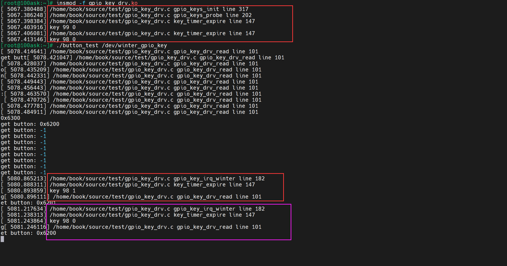

#### 6.3 总结

（1）在原来的gpio_key结构体中添加一个定时器，每个按键都有一个定时器；在probe设置定时器、设置超时时间、添加定时器；在remove函数中删除定时器；

（2）在超时处理函数中发送信号；

（3）在中断服务程序，修改定时器时间
